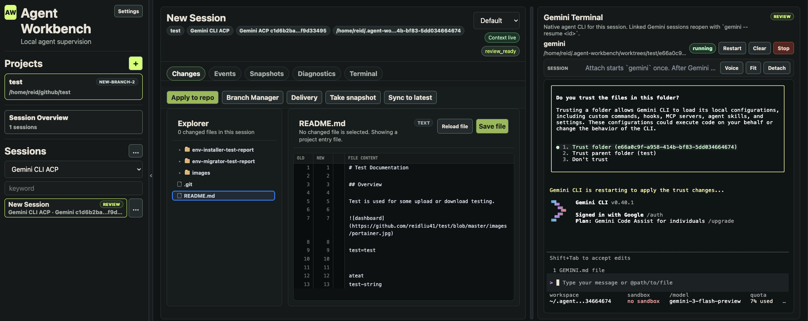

# Agent Workbench

Agent Workbench is a local-first web workspace for managing coding-agent work across multiple projects and multiple sessions.

It focuses on one practical workflow: run several agent tasks in parallel, keep them isolated, review the code changes clearly, then apply or deliver the work when it is ready.



Demo: [Watch Agent Workbench on YouTube](https://youtu.be/wkr-dKIUKNA)

## 🚀 Main Features

- 🚀 Multi-project management for local git repositories.
- 🔥 Multi-agent and multi-session workflow, with each session isolated from the others.
- 📊 Session Overview dashboard for current progress, status, blockers, changed files, and review state.
- 🤖 Gemini CLI, Codex CLI, Claude Code, Qwen Code, and GitHub Copilot CLI support through native terminal attach.
- 🔁 Native CLI resume binding: Workbench links Gemini, Codex, Claude, Qwen, and Copilot session IDs and reattaches with resume automatically.
- 🔎 Native session import for existing Gemini CLI, Codex CLI, Claude Code, and Qwen Code sessions.
- 👀 Changes view for reviewing CLI/agent edits immediately after they happen.
- 📝 Session Notes for human plans, review summaries, rules, and handoff context, with Markdown rendering after save.
- 🛠️ Review-first delivery: session branch, snapshots, add/commit/push, and Draft PR from the isolated worktree.
- 🧩 Apply patch fallback for moving reviewed session changes into another branch when needed.
- 🖥️ Enhanced split terminal projection: keep CLI input on the right and project a readable, color-preserving, zoomable transcript into the main workspace.
- 🎙️ Browser voice input for faster prompting when supported by browser permissions.
- 🖼️ Clipboard screenshot upload, inserting an image path into the CLI prompt.

## Install

Requirements:

- Node.js 20.19 or newer
- npm
- git

<details>
<summary>CLI support</summary>

Install and authenticate the CLIs you want to use:

- Gemini CLI for Gemini-backed sessions
- Codex CLI for Codex-backed sessions
- Claude Code for Claude-backed sessions
- Qwen Code for Qwen-backed sessions
- GitHub Copilot CLI for Copilot-backed sessions

</details>

Install the published package:

```bash
npm install -g @agent-workbench/cli
```

Start Agent Workbench:

```bash
agent-workbench serve
```

Check local runtime dependencies:

```bash
agent-workbench doctor
```

The default bind address is `127.0.0.1:3030`. The server prints a tokenized URL. Keep the token private.

## Run From Source

Install dependencies:

```bash
npm install
```

Run from source:

```bash
npm run serve
```

Check source dependencies:

```bash
npm run doctor
```

## Basic Usage

Agent Workbench is designed around one default rule: one implementation session should map to one real branch, one isolated worktree, and usually one PR. For large work, use one planning session to split the work, then create separate implementation sessions for each branch.

1. Open the Workbench URL in a browser.
2. Add a local git project.
3. Create a new session and choose a unique session branch.
4. Choose Gemini CLI, Gemini ACP, Codex CLI, Claude Code, Qwen Code, or GitHub Copilot CLI for the session.
5. Attach the native terminal from the right panel.
6. Workbench starts the selected CLI inside the isolated session worktree.
7. Workbench records the native CLI session ID and uses resume on later attaches.
8. Let the agent work in its isolated session worktree.
9. Review changed files in Changes.
10. Use Take snapshot before risky edits or rollback points.
11. Use Notes to keep human plans, review summaries, rules, or handoff context for the session. Notes are saved as session metadata and render Markdown after save.
12. Use Delivery to add, commit, push, and create a draft PR from the session branch.
13. Use Apply patch only when you intentionally need to move reviewed changes into another branch.

<details>
<summary>Import existing native CLI sessions</summary>

You can import existing native CLI sessions from the Sessions menu:

- Gemini CLI sessions from Gemini's local session store.
- Codex CLI sessions from Codex rollout metadata.
- Claude Code sessions from Claude project JSONL history.
- Qwen Code sessions from Qwen's project JSONL history. Workbench bridges the session file into the isolated worktree before resume.

Imported sessions become regular Workbench sessions and reopen through each CLI's resume command.

</details>

## CLI Backends

<details>
<summary>Gemini CLI</summary>

- Native terminal attach starts `gemini`.
- After Gemini creates a native session ID, Workbench records it.
- Later attaches use `gemini --resume <id>`.
- Gemini ACP remains available for structured tool events where supported.
- The Split button projects a read-only, color-preserving Gemini terminal transcript into the center workspace while input stays in the terminal.

</details>

<details>
<summary>Codex CLI</summary>

- Native terminal attach starts `codex --cd <session-worktree>`.
- After Codex writes its rollout metadata, Workbench records the Codex session ID.
- Later attaches use `codex resume --cd <session-worktree> <id>`.
- Codex slash commands, approvals, skills, and model controls stay native inside Codex CLI.

</details>

<details>
<summary>Claude Code</summary>

- Native terminal attach starts `claude --session-id <id>` in the session worktree.
- Workbench creates the Claude session ID up front, so the AW session and Claude session are bound from the first attach.
- Later attaches use `claude --resume <id>`.
- Claude Code slash commands, plugins, skills, hooks, permissions, and model controls stay native inside Claude Code.

</details>

<details>
<summary>Qwen Code</summary>

- Native terminal attach starts `qwen --session-id <id>` in the session worktree.
- Workbench creates the Qwen session ID up front, so the AW session and Qwen session are bound from the first attach.
- Later attaches use `qwen --resume <id>` after Qwen writes resumable session history.
- Existing Qwen sessions can be imported; Workbench rewrites the local Qwen session history path for the isolated worktree so resume works inside the AW session.
- Qwen Code slash commands, memory, approvals, and model controls stay native inside Qwen Code.

</details>

<details>
<summary>GitHub Copilot CLI</summary>

- Native terminal attach starts `copilot --resume=<id>` in the session worktree.
- Workbench creates the Copilot session ID up front, so the AW session and Copilot session are bound from the first attach. Copilot does not allow `--name` together with `--resume`, so Workbench keeps the human session title in AW metadata.
- Later attaches use `copilot --resume=<id>`.
- Copilot slash commands, MCP, custom agents, permissions, and rollback stay native inside GitHub Copilot CLI.
- Existing Copilot session import is not wired yet; this first integration path is new Workbench-managed Copilot sessions.

</details>

<details>
<summary>Split projection</summary>

- The right-side Agent Terminal remains the real interactive CLI.
- Split projects a read-only transcript into the center workspace for easier review.
- Projection preserves terminal cell colors and basic text styling.
- Projection filters the live input/footer/status area so the center view focuses on conversation and output.
- Projection has local zoom controls from 80% to 200%.

</details>

## Development

Run the development server:

```bash
npm run dev
```

Run checks:

```bash
npm run typecheck
npm run build
```

Additional smoke checks:

```bash
npm run smoke
```

## Built With

- [Gemini CLI](https://github.com/google-gemini/gemini-cli) - Google's official Gemini command-line coding agent.
- [Codex CLI](https://github.com/openai/codex) - OpenAI's command-line coding agent.
- [Claude Code](https://github.com/anthropics/claude-code) - Anthropic's command-line coding agent.
- [Qwen Code](https://github.com/QwenLM/qwen-code) - Qwen's command-line coding agent.
- [GitHub Copilot CLI](https://github.com/features/copilot/cli) - GitHub's terminal coding agent.
- [React](https://react.dev/) - User interface library.
- [Vite](https://vite.dev/) - Fast frontend build tool and development server.
- [Fastify](https://fastify.dev/) - Local HTTP and WebSocket server.
- [xterm.js](https://xtermjs.org/) - Browser terminal rendering.
- [node-pty](https://github.com/microsoft/node-pty) - Pseudo-terminal integration for native CLI sessions.

## Acknowledgments

Agent Workbench is built around the idea that native coding CLIs should keep their terminal-first power while gaining a web dashboard for multi-session supervision, review, snapshots, and delivery.

Gemini CLI, Codex CLI, Claude Code, Qwen Code, and GitHub Copilot CLI are the main native CLI workflows for the current release.

## Documentation

Detailed design and architecture notes are in [docs](docs/).
